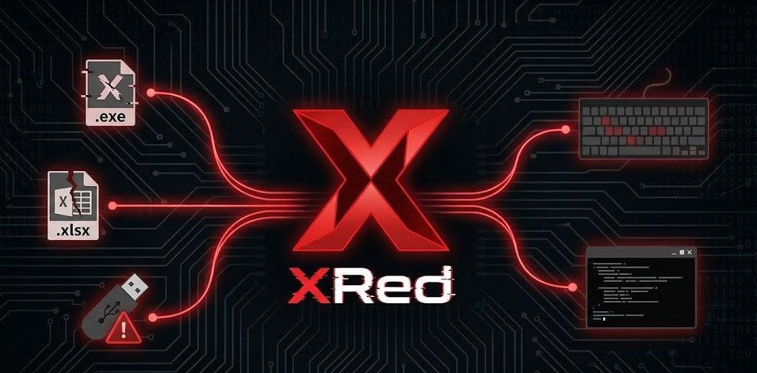

# Synaptics Killer


         
## 개요
**Synaptics Killer**는 시냅틱스(Synaptics) 백도어 바이러스에 감염된 파일(EXE, XLSX)을 복구하는 도구입니다.  

---

### 시냅틱스 바이러스란?
Synaptics 백도어로 알려진 **Xred Backdoor**는 2019년경부터 활동이 관측된 악성코드로, 웜(Worm) 형태로 전파됩니다.  
주로 Synaptics사의 노트북용 터치패드 드라이버 프로그램을 사칭하여 유포되며, 합법적인 소프트웨어 설치 프로그램처럼 위장해 사용자를 속이는 특징이 있습니다.  

---

## 악성 행위 분석
본 악성코드는 시스템 내부에 은밀한 백도어를 생성한 뒤,
레지스트리 키를 추가하여 **시스템 재부팅 이후에도 지속 실행되는 영속성(Persistence)**을 확보합니다.

이후 다음과 같은 악성 행위를 수행합니다:

- 다음과 같은 **시스템 세부 정보 수집**
  - 사용자 이름
  - MAC 주소
  - 컴퓨터 고유 식별자(Computer Identifier)
- 사용자 입력을 가로채는 **키 입력 로깅(Keylogging)** 수행
- 이동식 USB 매체의 `autorun.inf`를 악용하여 **추가적인 자기 확산 시도**
- 수집된 정보를 **SMTP 프로토콜을 통해 외부 공격자 서버로 전송(정보 유출)**

이러한 행위로 인해 악성코드는 장기간 사용자에게 인지되지 않은 상태로 시스템에 상주하며,
지속적인 정보 탈취 및 추가 확산을 목적으로 동작합니다.

해당 악성코드에 대한 **상세 분석 보고서**는 아래 링크에서 확인할 수 있습니다.

- 🔗 https://reversingnewbie.tistory.com/48

---

> **참고:**  
> 시냅틱스 바이러스는 주로 32비트 실행 파일을 대상으로 감염합니다.  

### 복구 결과 안내
- EXE 파일 감염: 데이터 손실이 발생하지 않으므로 **100% 복구 가능**  
- XLSX 파일 감염: 매크로 제거 후 복구되지만, 데이터 손실이 발생했을 경우 **완전 복구가 불가능할 수 있음**  

---

## 주요 기능
- 시냅틱스 바이러스에 감염된 **EXE / XLSX 파일 복구**
- 원본 파일 백업 생성 여부 선택 가능
- 감염된 프로세스(Synaptics.exe, EXCEL.EXE) 종료 및 레지스트리 제거
- 스캔 후 복구, 보고서 생성 및 자동 실행

---

## 사용법

1. **Restore without creating .bak file**  
   - 백업 파일을 생성하지 않고, 복구된 파일로 원본 파일을 덮어씁니다.  
   - 감염된 XLSM 파일은 삭제되고, 매크로 제거 후 생성된 XLSX만 남습니다.

2. **Restore with creating .bak file**  
   - 백업 파일(`.bak`)을 생성한 후, 복구된 파일로 덮어씁니다.  
   - 감염된 파일은 `.bak`로 보관되고, 매크로 제거된 XLSX가 새로 생성됩니다.

3. **Exit**  
   - 프로그램을 종료합니다.

---

## 복구 방법

### EXE 파일
1. `Downloads`, `Documents`, `Desktop` 폴더를 스캔  
2. `.exe` 파일의 **File Description** 문자열에 `"Synaptics Pointing Device Driver"`가 있는지 확인  
3. 리소스 섹션에서 **EXERESX 데이터**를 찾아 추출  
4. 추출된 데이터로 원본 EXE 파일을 복구

### XLSX 파일
1. `.xlsm` 파일을 스캔하여 매크로 존재 여부 확인  
2. 매크로 제거 후 `.xlsx` 파일로 복구  
3. 옵션에 따라 원본 `.xlsm` 삭제 또는 `.bak` 백업 생성

---
## 빌드 방법

Python 스크립트를 단일 실행 파일로 빌드하려면 **PyInstaller**를 사용합니다:

```bash
pip install pyinstaller
```

```bash
pyinstaller --onefile --name SynapticsRecovery Synaptics_Recovery.py
```
---

## 주의사항
- XLSX 파일은 일부 데이터가 손실될 수 있음  
- 복구 과정에서 원본 파일이 삭제되거나 덮어써질 수 있으니, 옵션 선택 시 주의 바랍니다

---

## License

This project is licensed under the **GNU General Public License v3.0 (GPL-3.0)** - see the [LICENSE](LICENSE) file for details.
